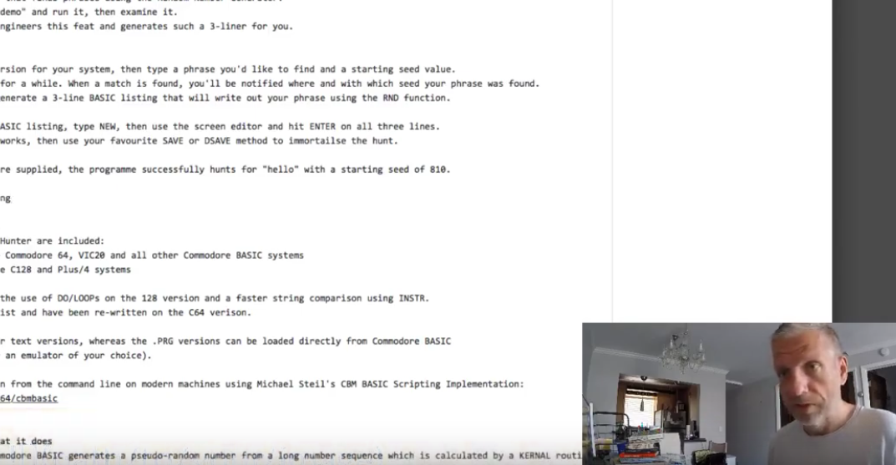

# present

We can put images 2 ways;

one, we can use markdown syntax

two, we can use html.

I will focus on markdown syntax

``

This will do.

Using absolute path is not a good idea.

I have created a folder named `images` in my repo

Then I will write

``

This is the result :

