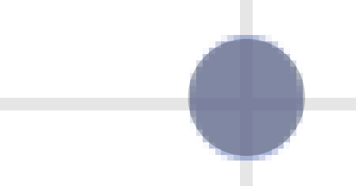
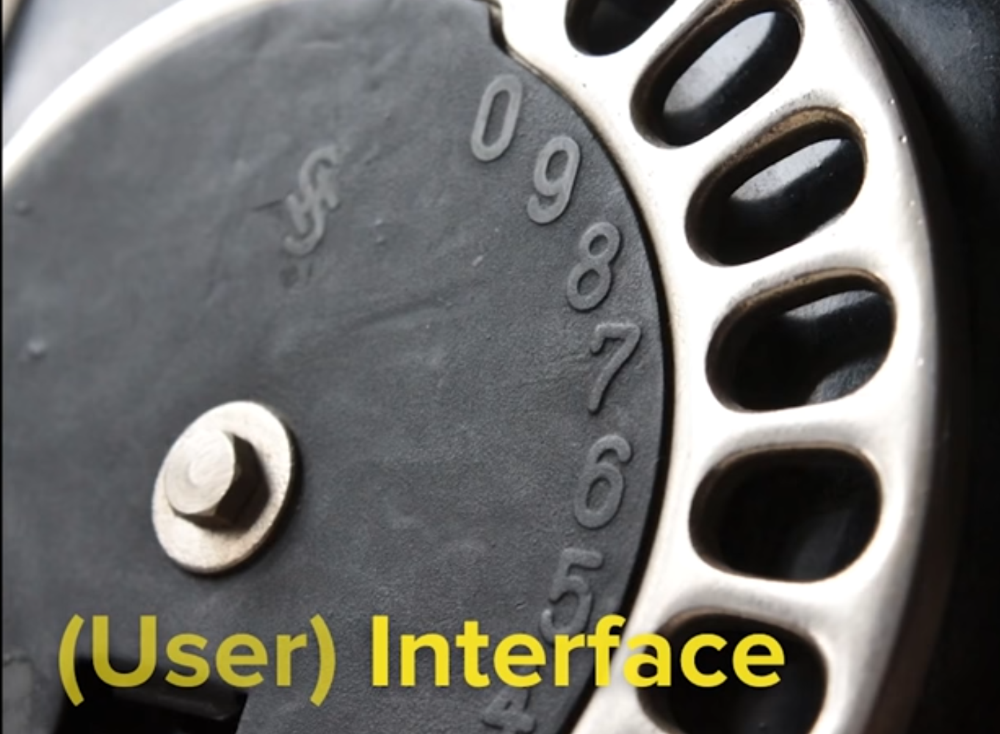

# 12월 29일

# Meta-Analysis

## Comparison of the efficacy and safety of new oral
anticoagulants with warfarin in patients with atrial
fibrillation: a meta-analysis of randomised trials

[Infographic How-To: Comparative Bubble Charts](https://www.copypress.com/blog/data-visualization-how-to-comparative-bubble-charts/)

A practical guide to producing effective visualisations for
research communication.pdf

## bubble chart
엑셀에 버블차트를 만들려면
3개의 변수가 필요하다.
세번째 변수가 버블의 크기를 결정하는 데 사용된다.

우리 데이터에선 ..

In our example data we don’t have sets of 3 values. We have sets of 1 value (# of tsp.). 
한 값을 갖고 있기 때문에 ‘필터값’을 줄거야.
we will place filler values in for the first 2 numbers in each set.  

B, C열에 있는 필터값은 버블이 차트에서 어디에 나타나는지 알려줄거야.
Those filler values (columns B and C) will determine where the bubbles appear on the chart.

일단 다 1을 줄거야
For the first value I put in 1 for each.

이렇게 해야 같은 y축에 있을거야..
This made it so that all the bubbles were graphed on the same y axis.

두번째 값으론 5, 10, 15, 20, 25를 넣었어.
이 값들은 5만큼 원의 중심을 떨어뜨려.
For the second value I entered 5, 10 , 15, 20 and 25. 
These values space the center of each circle 5 apart.

겹치면 이 수치를 조절해야됨. 겹치면 정확히 따기 어려우니까
We may need to adjust this when we see the final chart so that the bubbles don’t overlap. If they overlap we won’t be able to trace them accurately.

아까 얘기한대로 겹치니까, 띄워야겠지.
두번째 데이터 열에서 20, 25를 각각 25, 40으로 바꾸었다.
The chart below is what was generated based on the our selected data. You will notice that our bubbles are overlapping. We need to adjust the second data point in the 1 cup and 1 pint data sets so that they don’t overlap. Again, this is controlled by the numbers in column C in our spreadsheet

일러스트레이터에 복붙하고 따자.
Next, just use the ellipse tool to draw circles of the appropriate size on top of the chart. 

You can group the circles and scale them to the size you need. In the image below you see I drew black circles on top of the Excel chart. In the final step I grouped the circles, rotated them and scaled them to be bigger.

이렇게 옆에 비교할 그림을 넣으면 좋다.
When scaling the circles just make sure you scale them all together and maintain the original size ratio. As you can see these bubbles make much more sense.

# Illustrator - fill a shape with an image in illustrator
[How to Fill a Shape With an Image in Illustrator | Chron.com](https://smallbusiness.chron.com/fill-shape-image-illustrator-35067.html)

이미지를 찾는다

일러스트 > Place

# Google Cloud Platform

[API for beginners - YouTube](https://www.youtube.com/watch?v=oBW_VNg4qD0)

정보
[Have you ever wondered how Facebook is able to automatically display your Instagram photos? How about how Evernote syncs notes between your computer and smartphone? If so, then it’s time to get excited! During this 2 hour workshop, we'll walk you through what it takes to link different IT systems together thanks to this common tool called an Application Programming Interface (API). We will start off easy, explaining the basics of (web) APIs: what they are, how they work, and why they matter.]

API means
Application Program Interface
; it is an Interface,
used by Programs to interact
with an Application

## What is an interface?

## APIs expose something useful 

Developers write programs which consumes APIs

## Web APIs

when we use keyboard or click on trackpad,
that is an API on OS

APIs are in everywhere

but we will talk about web APIs

Go to “programmable web”

They have APIs

## Google Maps Javascript v3

# Google Geocoding API

