# 12월 29일 -2
## 패턴을 넣어보자 (일러스트)
[How to create and apply patterns | Adobe Illustrator CC tutorials](https://helpx.adobe.com/illustrator/how-to/create-apply-patterns.html)

workspace를 painting으로 만든다.
object를 클릭하고
swatch에 패턴을 찾아 클릭하면 적용된다.
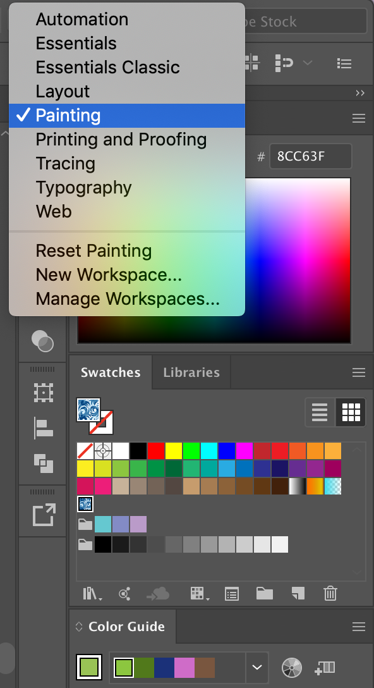

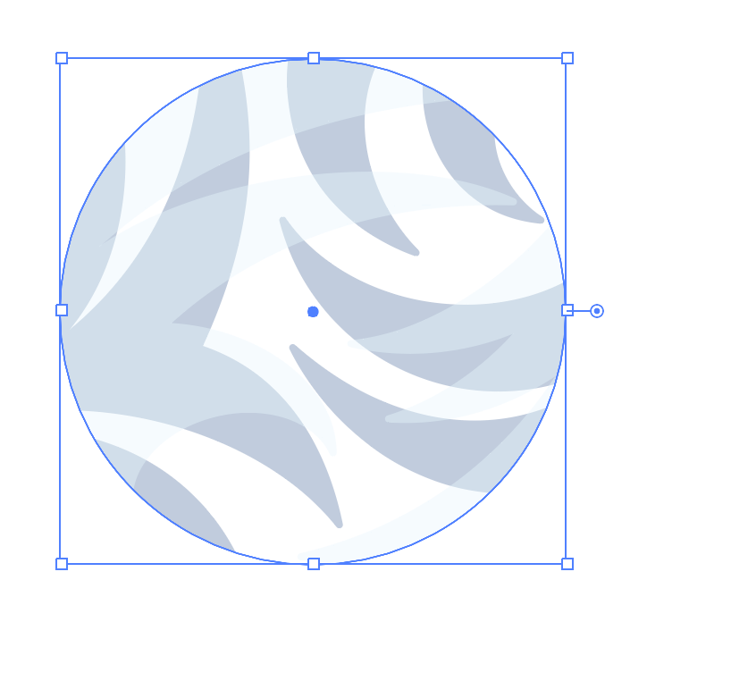

## Blob Brush를 셋업하기

뭔진 모르겠지만 일단 해보자.
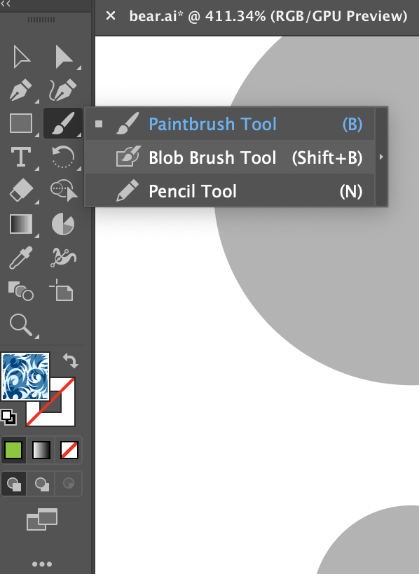

더블 클릭하면, 옵션이 열린다.

## artboard tool
: 크기를 조절하거나 새로운 artboard를 추가할 수 있다.

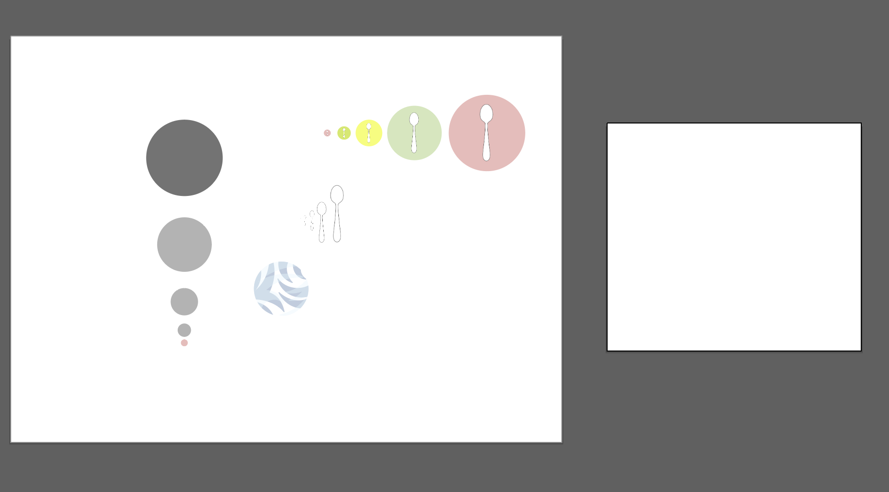

## object로부터 패턴 만들기
사람인 자를 Blob Brush로 그렸다.
V (selection tool)로 이 object를 선택하고,
shape를 swatch로 드래그한다.

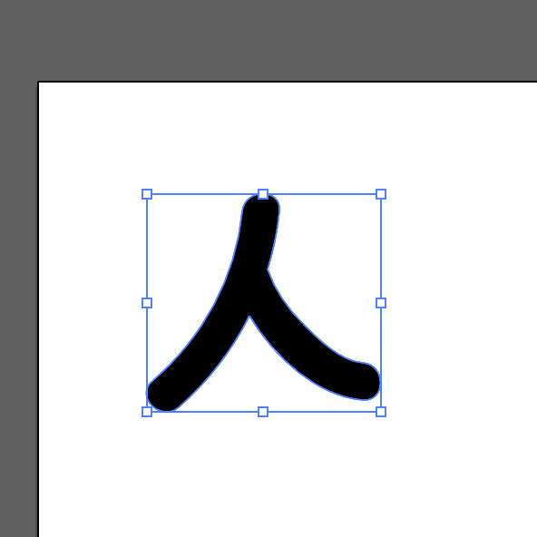

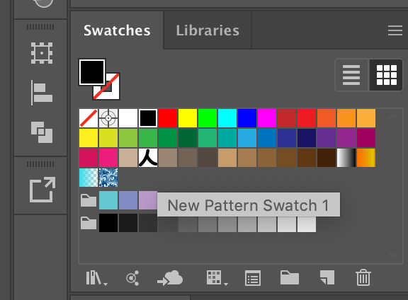

새로운 패턴이 추가되었다.

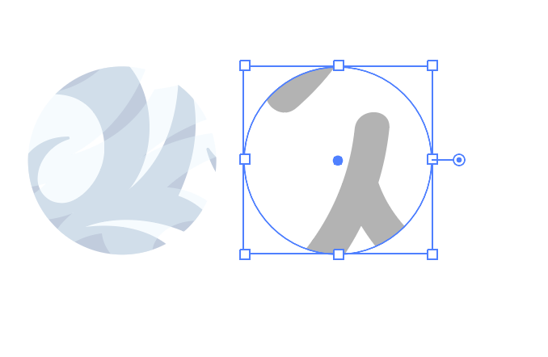

적용해본 결과

패턴이 약간 크다는 것을 알 수 있었다.

## 패턴 수정하기

원에서 벗어나고, swatch에서 패턴을 더블클릭한다.

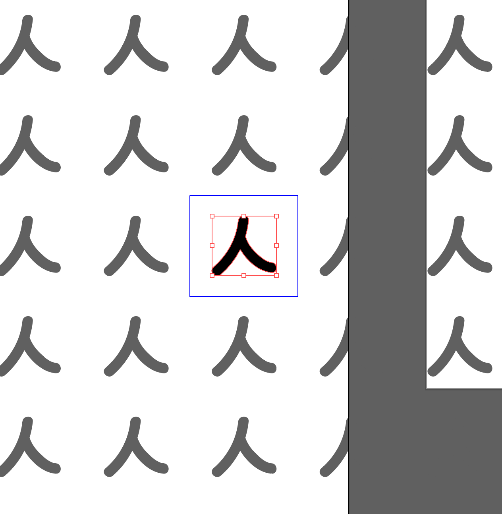

드래그하면 크기를 조정할 수 있다.

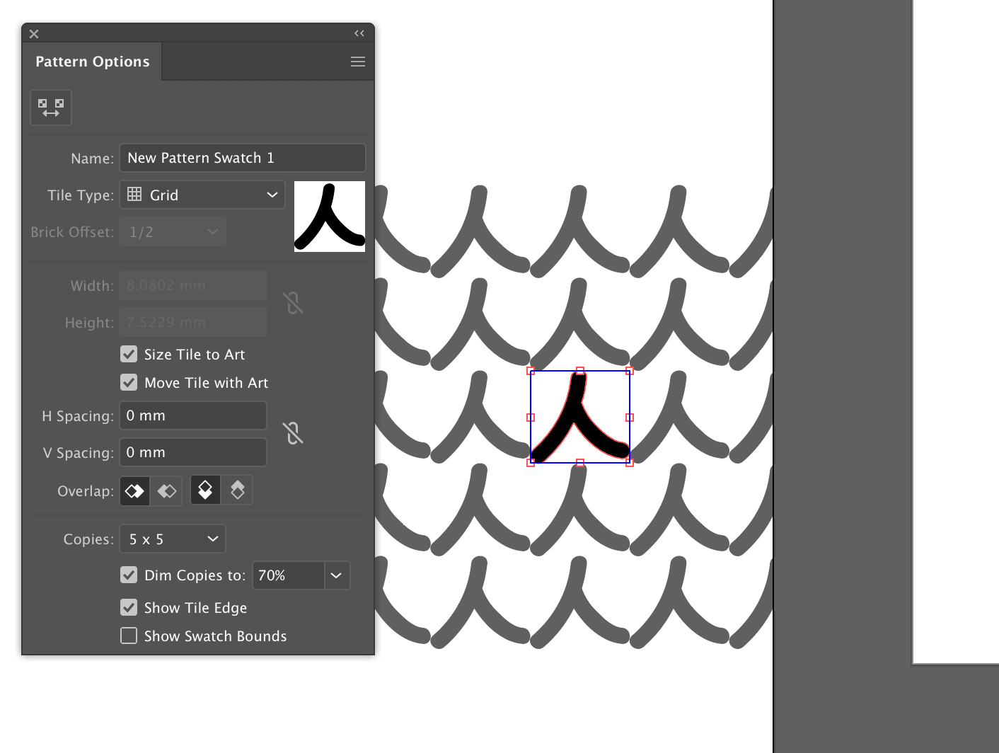

size tile to art 옵션을 선택하면 모이게 된다.

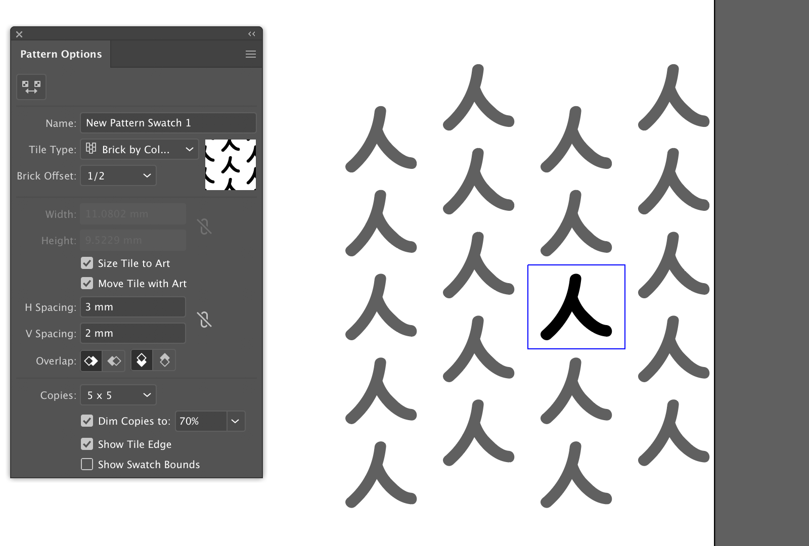

기타 옵션을 선택하여 `타일의 간격` , `타일 패턴` 을 조절할 수 있다.

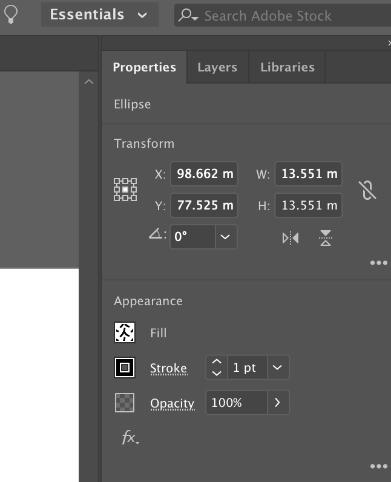
essential  > stroke에 값을 주면 outline이 생긴다.

